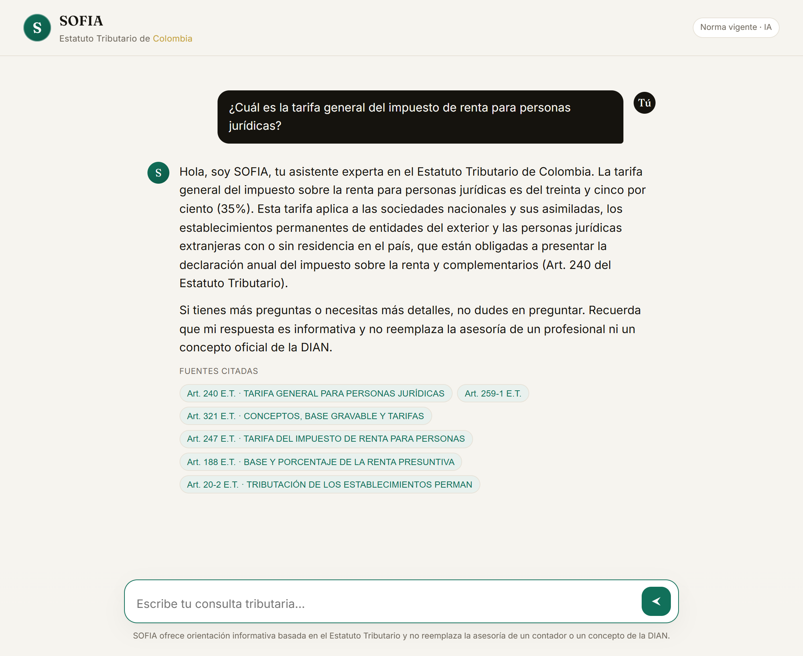

<div align="center">

# SOFIA · Estatuto Tributario de Colombia

**IA conversacional (RAG) que responde dudas tributarias citando la norma vigente.**

</div>



SOFIA es una asistente que conversa sobre el **Estatuto Tributario de Colombia**
(Decreto 624 de 1989 y reformas). Recupera los artículos pertinentes y responde
con citas verificables (`Art. XX del Estatuto Tributario`).

## Arquitectura

```
PDF oficial (2.321 págs.) ─ parser.py ─▶ 1.317 artículos jerárquicos (Libro › Título › Capítulo › Artículo)
                                          │ build_index.py (embeddings OpenAI)
                                          ▼
                            índice vectorial portable (numpy + JSON, ~8 MB, sin BD externa)
                                          │ rag.py  (semántica + nº de artículo + sinónimos)
                                          ▼
                            agent.py  →  SOFIA (GPT-4o, respuestas ancladas con cita)
                                          ▼
                            server.py →  FastAPI + chat web con streaming
```

## Ejecutar en local

```bash
pip install -r sofia/requirements.txt
echo "OPENAI_API_KEY=sk-..." > .env
python -m sofia.server          # http://localhost:8000
```

## Desplegar en Render (gratis)

1. Sube este repo a GitHub.
2. En [Render](https://render.com): **New → Blueprint** y elige el repo
   (detecta `render.yaml`).
3. Pega tu `OPENAI_API_KEY` cuando lo pida y crea el servicio.
4. Obtendrás una URL pública `https://sofia-estatuto-tributario.onrender.com`.

El índice ya está precalculado en `data/`, así que no hay pasos extra.

## Estructura

| Archivo | Rol |
|---|---|
| `sofia/parser.py` | PDF → estructura jerárquica (`data/estatuto.json`) |
| `sofia/build_index.py` | Embeddings → `data/chunks.json` + `data/embeddings.npy` |
| `sofia/rag.py` | Motor de recuperación híbrido |
| `sofia/agent.py` | Persona y reglas de SOFIA (`SYSTEM_PROMPT`) |
| `sofia/server.py` | API FastAPI + streaming |
| `sofia/web/index.html` | Interfaz de chat (minimalista) |

> SOFIA ofrece orientación informativa y no reemplaza la asesoría de un contador
> ni un concepto oficial de la DIAN.
